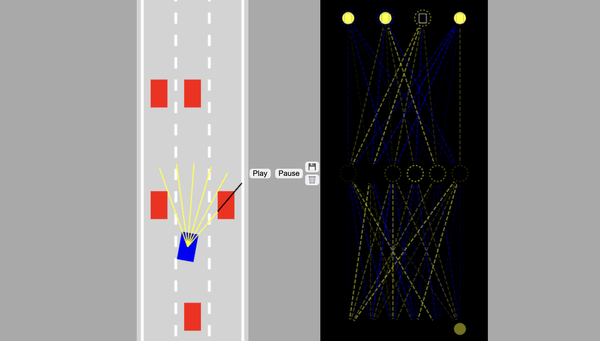

# Self Driving car (JS with no libraries) 🚗
The course to develop this project is given by [FreeCodeCamp](https://www.freecodecamp.org/news/self-driving-car-javascript/) 

## Preview

## Run the project locally
1. clone the repo
2. open the terminal and navigate to che cloned directory
3. open *index.html* 
